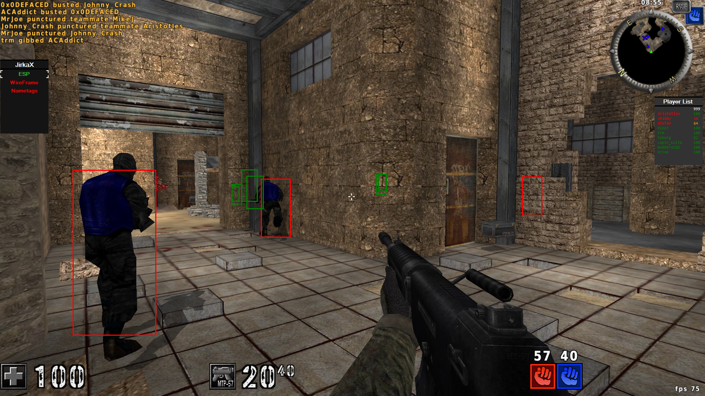

# JirkaX - AssaultCube Cheat Client

A modular AssaultCube cheat written in C# (.NET), featuring a login/register system, runtime injection, in-game WinForms-based cheat menu, player list, and JSON/database configuration management.

**JirkaX** is an external cheat client for AssaultCube (crated in 2023), featuring:
- In-game module menu with keyboard navigation (Numpad 2/4/5/6/8)
- Persistent configuration system (file & database based)
- Player list with real-time data (names, health, team)
- Visuals (ESP, Nametags, Wireframe)
- Memory patching for Infinite Ammo, Health, Armor, etc.

> This project is intended for educational and personal use only.

---

## Features

### Combat
- Aimbot
- FastReload
- FastGrenades

### Movement
- AutoJump
- Fly

### Misc
- Infinite Ammo / Health / Armor / Grenades
- TeamChanger

### Visual
- ESP
- WireFrame
- Nametags

---

## In-Game Menu Screenshot

Here's a preview of the fully injected in-game cheat menu:

---

## Controls

| Key       | Action                        |
|-----------|-------------------------------|
| F9        | Toggle overlay visibility     |
| Numpad 5  | Enable/Disable module         |
| Numpad 2  | Move down                     |
| Numpad 8  | Move up                       |
| Numpad 6  | Enter submenu                 |
| Numpad 4  | Go back to main menu          |
| Delete    | Save config & exit            |

---

## Authentication & Injection

The application includes a fully functional **Login/Register system** connected to a local database.  
After successful authentication, the user is allowed to inject the cheat into the game.  
Once injected, the user can open the in-game cheat menu and use all enabled features.

---

## Configuration

- Saves to either **JSON file** or **remote database** based on user setting.
- On exit (`Delete` key), current module states and values are saved.

---

## Player List

- Shows live data for teammates and enemies:
  - Name
  - Health
  - Team

---

## Web Interface (Unfinished)

The project contains a **partially implemented and currently commented-out** web interface.  
It was originally planned for remote control and real-time monitoring of modules and player data.

> This part is non-functional and excluded from the final build. Code is kept for potential future development.

---

## Project Status & Known Issues

This project is no longer actively developed and contains several bugs, unoptimized parts, and problematic sections.
Some features, such as the web interface, remain unfinished and commented out.
The codebase may have performance issues, especially with the WinForms overlay menu causing lag and rendering artifacts.

Additionally, the project uses outdated or suboptimal technologies, primarily relying on WinForms for the overlay UI, which is not ideal for smooth, low-latency in-game rendering.
Modern cheats and game overlays typically use more suitable technologies such as OpenGL, DirectX hooks, or other graphics APIs for better performance and stability.

Due to the project's discontinued status, no further fixes or improvements are planned.

## Legal Notice

This software interacts directly with game memory and violates game terms of service. It is provided for **educational purposes only**. Use at your own risk.

---

## Author

Created by [Jyrycek](https://github.com/Jyrycek) in 2023.
